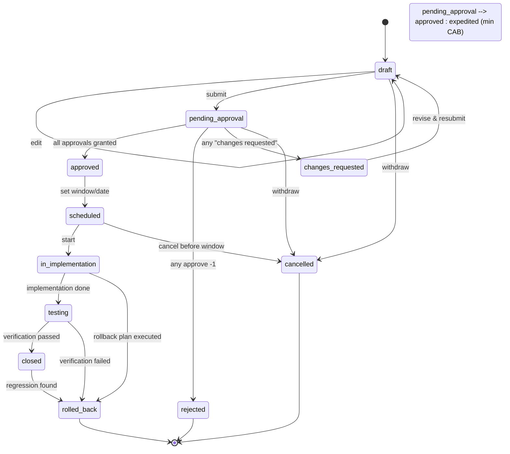

# Change Management Plan — Enterprise Innovation & Delivery Hub (EIDH)

**Stack:** Node.js + React + Turso (libSQL) | **Version:** 1.0 | **Date:** 2026-08-24
**Scope:** A Change Management (ITIL-style Change Enablement / CAB) capability for the CoE/ALM Portal
**Decision:** **Build into EIDH** as a bounded subdomain (own route group + a small set of new tables + own frontend feature). See [§2 Option Analysis](#2-option-analysis).

---

## Table of Contents

1. [Executive Summary & Recommendation](#1-executive-summary--recommendation)
2. [Option Analysis: Build-In vs. Standalone App](#2-option-analysis-build-in-vs-standalone-app)
3. [Scope & Definitions](#3-scope--definitions)
4. [Domain Model & Data Schema (Turso SQL)](#4-domain-model--data-schema-turso-sql)
5. [Roles & Permissions (RBAC / CAB)](#5-roles--permissions-rbac--cab)
6. [Change Lifecycle (State Machine)](#6-change-lifecycle-state-machine)
7. [API Specification](#7-api-specification)
8. [Screen Mockups & UX](#8-screen-mockups--ux)
9. [Frontend Integration](#9-frontend-integration)
10. [AI Augmentation (optional, reuses Module B/E infra)](#10-ai-augmentation-optional)
11. [Guardrails, Governance & Audit](#11-guardrails-governance--audit)
12. [Phased Build Plan](#12-phased-build-plan)
13. [Open Questions / TODOs](#13-open-questions--todos)
14. [Verification Checklist](#14-verification-checklist)

---

## 1. Executive Summary & Recommendation

**Problem:** The hub already manages *intake → prioritize → plan → build → deploy → support*. But **getting a change into production** (config, infra, DB, app releases) has no governed gate. Teams make ad-hoc production changes with no review, no risk assessment, no rollback plan, and no audit trail. This is a gap between a "deployment" (a technical event) and a "change" (a governed, approved, reversible decision).

**Solution:** Add a **Change Management module** that wraps the existing `projects` / `requirements` / `sprints` / `deployments` data with a **Change Request (RFC)** record, a **risk assessment**, a **CAB approval chain**, an **implementation task checklist**, and a **change-freeze / release calendar**. Every production-affecting deployment can then be traced to an approved change.

**Recommendation:** **Build into EIDH.** The change record references the same `projects`, `users`, `business_units`, and `deployments` that already exist. It is a *governance wrapper*, not a new product. A standalone app would duplicate identity, the project catalogue, RBAC, shared Zod schemas, and the DB — and would still need to join back to EIDH project IDs. Build it here, but keep it **boundary-clean** so it can be extracted later if a separate governance/audit surface becomes a firm requirement.

---

## 2. Option Analysis: Build-In vs. Standalone App

| Dimension | Build into EIDH | Standalone app |
| --- | --- | --- |
| **Shared data** | Reuses `projects`, `users`, `business_units`, `deployments`, `requirements`, `comments` | Needs its own copy + sync; cross-app joins become "integration headaches" |
| **Identity / SSO** | Same auth + `roles` today | Needs separate auth or a second issuer |
| **RBAC** | Same role model (`pm`, `executive`, `support`, …) | Must re-model + sync roles |
| **Change ↔ Deploy link** | One DB, direct FK | API bridge, eventual consistency |
| **Code reuse** | Shared `@eidh/shared` Zod schemas, `ApiError`, validation middleware | Duplicate the envelope + validation |
| **Release cadence** | One monorepo, one CI/CD | Two pipelines, two deploy surfaces |
| **Dev effort** | Lower (leverage existing infra) | Higher (new shell, new DB app, new CI) |
| **User experience** | One portal; change detail can link straight to the PR/deploy | Navigate between two tools |
| **Governance isolation** | Softer — same DB, same audit table | Harder boundary, independent audit |
| **When it wins** | Governance is a *workflow* over existing delivery data | Regulatory/audit org demands a physically separate, independently-audited system; different owner/cadence |

**Recommendation:** Build-in, **contained as a subdomain**:
- Own route group (`server/src/routes/change.*` mounted at `/api/v1/change`).
- Own controller group (`server/src/controllers/change.ts`).
- New Drizzle tables (`change_requests`, `change_tasks`, `change_approvals`, `change_windows`, `cab_members`).
- New client page group under `client/src/pages/change/` + a "Change" nav item.
- Reuse `comments` (polymorphic, `entity_type='change'`) for the discussion thread, and `ai_insights`/`ai_audit_logs` for the optional AI layer.

> **If extracted later:** because the tables are namespaced and the API is its own group, a standalone service could own that route group + tables and expose the same `/api/v1/change` contract, with the rest of EIDH calling it over HTTP. Budget ~3-5 days to split if ever required.

---

## 3. Scope & Definitions

### Change types (ITIL-aligned)
| Type | Definition | Approval required? |
| --- | --- | --- |
| `standard` | Pre-approved, low-risk, repeatable (e.g. routine config) | No (auto-approved by policy) |
| `normal` | Standard RFC, needs CAB review | Yes |
| `major` | High-impact / customer-facing / costly | Yes (possibly 2nd-level + exec sign-off) |
| `emergency` | Security fix / Sev-1 recovery, expedited | Post-incident or live CAB |

### Change statuses (state machine)
`draft → pending_approval → approved/scheduled → in_implementation → testing → closed` (with `rejected`, `rolled_back`, `cancelled` as terminal).

### Change priority & risk
- Priority: `low | medium | high | critical` (reuse pattern).
- Risk: `low | medium | high` (assessed risk to service).

### Out of scope (for now)
- Actual CI/CD orchestration (that's `deployments`). CM **records & gates** the change; `deployments` records the technical result.
- Network/OS-level infra automation. Tracked as change *records* only.
- Asset/CMDB management beyond a service-owner free-text link.

---

## 4. Domain Model & Data Schema (Turso SQL)

> Mirrors the style of `enterprise-hub-spec.md` §5. In code this is expressed as a **Drizzle** schema in `server/src/db/schema.ts` (see §9).

```sql
-- CHANGE REQUEST (the RFC)
CREATE TABLE change_requests (
  id TEXT PRIMARY KEY,
  title TEXT NOT NULL,
  description TEXT,
  type TEXT CHECK(type IN ('standard','normal','major','emergency')) DEFAULT 'normal',
  category TEXT CHECK(category IN ('infrastructure','application','data','security','business')) DEFAULT 'application',
  priority TEXT CHECK(priority IN ('low','medium','high','critical')) DEFAULT 'medium',
  risk TEXT CHECK(risk IN ('low','medium','high')) DEFAULT 'medium',
  status TEXT CHECK(status IN ('draft','pending_approval','approved','scheduled','in_implementation','testing','closed','rejected','rolled_back','cancelled')) DEFAULT 'draft',
  reason TEXT,                 -- business justification
  implementation_plan TEXT,    -- what will be changed
  rollback_plan TEXT,          -- how to undo (REQUIRED for normal/major/emergency)
  test_plan TEXT,              -- verification steps / regression scope
  project_id TEXT REFERENCES projects(id) ON DELETE SET NULL,  -- optional link
  requested_by TEXT REFERENCES users(id),
  service_owner TEXT REFERENCES users(id),   -- accountable for the change
  planned_start_at DATETIME,
  planned_end_at DATETIME,
  actual_start_at DATETIME,
  actual_end_at DATETIME,
  implemented_at DATETIME,     -- when the deployment actually went live
  created_at DATETIME DEFAULT CURRENT_TIMESTAMP,
  updated_at DATETIME
);
CREATE INDEX change_requests_project_idx ON change_requests(project_id);
CREATE INDEX change_requests_status_idx ON change_requests(status);

-- IMPLEMENTATION TASK CHECKLIST
CREATE TABLE change_tasks (
  id TEXT PRIMARY KEY,
  change_id TEXT NOT NULL REFERENCES change_requests(id) ON DELETE CASCADE,
  title TEXT NOT NULL,
  assignee_id TEXT REFERENCES users(id),
  status TEXT CHECK(status IN ('todo','in_progress','done')) DEFAULT 'todo',
  position INTEGER DEFAULT 0
);
CREATE INDEX change_tasks_change_idx ON change_tasks(change_id);

-- CAB / APPROVAL CHAIN (multi-stage)
CREATE TABLE change_approvals (
  id TEXT PRIMARY KEY,
  change_id TEXT NOT NULL REFERENCES change_requests(id) ON DELETE CASCADE,
  approver_id TEXT NOT NULL REFERENCES users(id),
  stage INTEGER DEFAULT 1,             -- 1 = CAB, 2 = exec/escalation
  role_label TEXT,                     -- 'cab_member' | 'service_owner' | 'it_manager'
  decision TEXT CHECK(decision IN ('pending','approved','rejected','changes_requested')) DEFAULT 'pending',
  comment TEXT,
  decided_at DATETIME
);
CREATE INDEX change_approvals_change_idx ON change_approvals(change_id);

-- CAB MEMBERSHIP (which users can approve)
CREATE TABLE cab_members (
  user_id TEXT NOT NULL REFERENCES users(id) ON DELETE CASCADE,
  member_type TEXT CHECK(member_type IN ('cab_member','service_owner','it_manager')) DEFAULT 'cab_member',
  PRIMARY KEY (user_id, member_type)
);

-- CHANGE & RELEASE WINDOWS / FREEZE CALENDAR
CREATE TABLE change_windows (
  id TEXT PRIMARY KEY,
  name TEXT NOT NULL,
  kind TEXT CHECK(kind IN ('window','freeze')) DEFAULT 'window',
  start_at DATETIME NOT NULL,
  end_at DATETIME NOT NULL,
  scope TEXT                        -- optional: BU / project / service scope for the freeze
);
CREATE INDEX change_windows_dates_idx ON change_windows(start_at, end_at);
```

**Design notes:**
- `project_id` is **nullable + ON DELETE SET NULL** so a change can exist in advance of, or independent of, a project — but when present, links to the live project.
- `rollback_plan` and `implementation_plan` are validated as **required for `normal`/`major`/`emergency`** types in the shared Zod schema, enforcing ITIL practice at the API layer.
- The **discussion thread** reuses the existing polymorphic `comments` table with `entity_type='change'`, `entity_id=<change_id>` — no new comments table.
- We **do not** add a `change_risks` table; risk is a single `risk` column PLUS a `reason` field for the impact statement. Adding a multi-row risk register is a listed Open Question (§13).

---

## 5. Roles & Permissions (RBAC / CAB)

Reuses the existing `users.role` enum: `requestor | analyst | developer | pm | executive | support`.

| Action | Allowed roles |
| --- | --- |
| Create / edit a draft change | `pm`, `analyst`, `developer`, `execute` (via requestor) |
| Submit for approval | `pm`, `analyst` |
| Approve / reject (CAB) | `executive`, `pm` who is a `cab_member` (from `cab_members`) |
| Emergency approval (escalation) | `executive` only |
| Implement / mark closed / rollback | `pm`, `developer`, `support` |
| Read / view any change | All authenticated |
| Manage freeze calendar | `executive`, `pm` |

**Enforcement:** A `requireChangeRole(...)` route guard compose-able with the existing `requireAuth`. `cab_members` drives the approver whitelist; `change_approvals.decision` records who decided and when. This mirrors the AI-plan guardrail §11 (RBAC parity) — no autonomous writes, every state transition is a human action recorded in the audit rows.

---

## 6. Change Lifecycle (State Machine)



**Transitions & guards:**
- `submit` requires `rollback_plan` + `implementation_plan` for `normal`/`major`/`emergency`.
- A **freeze** (`change_windows.kind='freeze'`) blocks `scheduled` transitions that overlap the freeze range — enforced in the controller (and surfaced in the UI calendar).
- `closed` sets `implemented_at` (and back-fills the linked `deployments` row's `deployed_at` if a deployment was recorded). This is the integration seam to the existing `deployments` table.

---

## 7. API Specification

> Conventions match `enterprise-hub-spec.md` §8: `/api/v1`, Zod-validated bodies from the shared `@eidh/shared` package, `{ data }` / `{ error }` envelopes, bearer auth. `express-async-errors` already ensures async throws reach the error handler.

### 7.1 Endpoint Overview (all under `/api/v1/change`)

| Method | Path | Auth | Description |
| --- | --- | --- | --- |
| `GET` | `/api/v1/change/requests` | ✅ | List/filter RFCs (query: `status`, `type`, `priority`, `projectId`, `requestedBy`) |
| `POST` | `/api/v1/change/requests` | ✅ | Create a change request |
| `GET` | `/api/v1/change/requests/:id` | ✅ | Detail incl. `tasks`, `approvals`, `window` |
| `PATCH` | `/api/v1/change/requests/:id` | ✅ | Update fields (draft only) |
| `DELETE` | `/api/v1/change/requests/:id` | ✅ | Delete (draft/cancelled only) |
| `POST` | `/api/v1/change/requests/:id/tasks` | ✅ | Add implementation task |
| `PATCH` | `/api/v1/change/tasks/:taskId` | ✅ | Update task status/assignee |
| `POST` | `/api/v1/change/requests/:id/submit` | ✅ | Move to `pending_approval` |
| `POST` | `/api/v1/change/requests/:id/approvals` | ✅ | Record a CAB decision (approve/reject/changes_requested) |
| `POST` | `/api/v1/change/requests/:id/schedule` | ✅ | Set `planned_start_at`/`planned_end_at` → `scheduled` |
| `POST` | `/api/v1/change/requests/:id/implement` | ✅ | Start implementation |
| `POST` | `/api/v1/change/requests/:id/complete` | ✅ | Verify + mark `closed`, set `implemented_at` |
| `POST` | `/api/v1/change/requests/:id/rollback` | ✅ | Execute `rollback_plan` → `rolled_back` |
| `POST` | `/api/v1/change/requests/:id/cancel` | ✅ | Withdraw/cancel |
| `GET` | `/api/v1/change/windows` | ✅ | List windows & freezes |
| `POST` | `/api/v1/change/windows` | ✅ | Create a release window / freeze |
| `GET` | `/api/v1/change/calendar` | ✅ | Aggregated calendar feed (for dashboard month view) |

### 7.2 Request / Response Contracts (shared Zod)

```ts
// shared/src/schemas.ts  (added)
export const changeTypeSchema = z.enum(['standard', 'normal', 'major', 'emergency']);
export const changeCategorySchema = z.enum(['infrastructure', 'application', 'data', 'security', 'business']);
export const changeRiskSchema = z.enum(['low', 'medium', 'high']);
export const changeStatusSchema = z.enum(['draft','pending_approval','approved','scheduled','in_implementation','testing','closed','rejected','rolled_back','cancelled']);
export const changePrioritySchema = z.enum(['low', 'medium', 'high', 'critical']);

export const createChangeRequestSchema = z.object({
  title: z.string().min(1),
  description: z.string().optional(),
  type: changeTypeSchema.default('normal'),
  category: changeCategorySchema.default('application'),
  priority: changePrioritySchema.default('medium'),
  risk: changeRiskSchema.default('medium'),
  reason: z.string().optional(),
  implementationPlan: z.string().optional(),
  rollbackPlan: z.string().optional(),
  testPlan: z.string().optional(),
  projectId: z.string().optional(),
  serviceOwner: z.string().optional(),
  plannedStartAt: z.string().datetime().optional(),
  plannedEndAt: z.string().datetime().optional(),
}).superRefine((val, ctx) => {
  if (['normal', 'major', 'emergency'].includes(val.type!) && !val.rollbackPlan) {
    ctx.addIssue({ code: 'custom', path: ['rollbackPlan'], message: 'Rollback plan is required for this change type' });
  }
});

export const updateChangeRequestSchema = createChangeRequestSchema.partial();
export const createChangeTaskSchema = z.object({ title: z.string().min(1) });
export const updateChangeTaskSchema = z.object({
  title: z.string().min(1).optional(),
  assigneeId: z.string().optional(),
  status: z.enum(['todo', 'in_progress', 'done']).optional(),
});
export const approveChangeSchema = z.object({
  decision: z.enum(['approved', 'rejected', 'changes_requested']),
  comment: z.string().optional(),
});
export const scheduleChangeSchema = z.object({
  plannedStartAt: z.string().datetime(),
  plannedEndAt: z.string().datetime(),
});
export const createChangeWindowSchema = z.object({
  name: z.string().min(1),
  kind: z.enum(['window', 'freeze']).default('window'),
  startAt: z.string().datetime(),
  endAt: z.string().datetime(),
  scope: z.string().optional(),
});
```

Example payloads:

```jsonc
// POST /api/v1/change/requests
{
  "title": "Migrate auth to OIDC",
  "type": "major",
  "category": "application",
  "priority": "high",
  "risk": "high",
  "reason": "Deprecate legacy session cookies",
  "implementationPlan": "Deploy auth-service v3, cut over feature flag",
  "rollbackPlan": "Feature flag to legacy; redeploy auth-service v2",
  "testPlan": "Login, SSO, session refresh regression",
  "projectId": "prj-1001",
  "serviceOwner": "usr-0002",
  "plannedStartAt": "2026-08-28T02:00:00Z",
  "plannedEndAt": "2026-08-28T05:00:00Z"
}
```

```jsonc
// POST /api/v1/change/requests/:id/approvals
{ "decision": "approved", "comment": "Rollback is clean; approved for Fri window" }
```

```jsonc
// GET /api/v1/change/requests/:id  → 200
{ "data": { "id": "chg-1001", "title": "Migrate auth to OIDC", "status": "pending_approval",
            "tasks": [], "approvals": [ { "stage": 1, "approverId": "usr-0001", "decision": "pending" } ] } }
```

---

## 8. Screen Mockups & UX

Reuse the existing `PageHead`, `Panel`, `Table`, `Badge`, `StatusBadge`, and design tokens (`docs/styles/master-css-style.md`).

**Nav:** add **Change** to the sidebar between *My Work* and *Support*.

**Screen C1 — Change Board (`/change`)** — a kanban like `/portfolio`:
- Columns: Draft | Pending Approval | Approved/Scheduled | In Implementation | Testing | Closed | Rejected/Rolled Back.
- Card: title, `type` + `priority` badge, risk dot, requested-by avatar, planned window.
- Filters: Type, Priority, Status, "My Changes". Actions: "New Change" button.

**Screen C2 — Change Detail (`/change/:id`)** — summary + tabs:
- **Summary:** title, type, status badge, risk, category, project link (→ `/projects/:id`), service owner, requested by, planned/actual times. "Submit for approval" when draft.
- **Timeline rail:** status history (each transition recorded) — reuse the pattern from ProjectDetail "Recent Activity."
- **Assessment tab:** description, reason, implementation plan, **rollback plan** (highlighted), test plan — all editable in draft.
- **Approvals tab:** CAB approval chain (one row per required approver + decision/comment/decided-at). Reviewer sees Approve / Reject / Request changes.
- **Tasks tab:** implementation checklist (`todo`/`in_progress`/`done`), assignable.
- **Activity tab:** polymorphic `comments` thread on the change.
- **Actions (gated by state):** Submit → Schedule → Implement → Complete → Rollback → Cancel. Each posts to the transition endpoint.

**Screen C3 — Change Calendar (`/change/calendar`)** — month/week view (reuse a simple calendar or `react-big-calendar`):
- Release windows as spans; **freeze** periods highlighted/red.
- Clicking a window opens the changes scheduled in it; scheduling inside a freeze is blocked (controller + UI).

**Screen C4 — Freeze Admin (`/change/freezes`)** — `executive`/`pm` create/edit windows & freezes. (Could fold into C3.)

**Integrations:**
- On **Project Detail → Deployments**, show the linked change (if any) and a "Request change" shortcut; a deployment can't be marked `deployed` without a linked approved change (configurable — see Open Questions).
- On **Support tickets** that are Sev-1/P1, a one-click "Raise emergency change" prefills the RFC from the ticket.

---

## 9. Frontend Integration

**Routing** (`client/src/App.tsx`):
```tsx
<Route path="/change" element={<ChangeBoard />} />
<Route path="/change/:id" element={<ChangeDetail />} />
<Route path="/change/calendar" element={<ChangeCalendar />} />
```

**Server wiring** (`server/src/index.ts`):
```ts
import changeRouter from './routes/change';
app.use('/api/v1/change', requireAuth, changeRouter);
```

**Client API** (`client/src/lib/api.ts`):
```ts
listChangeRequests(params?, createChangeRequest(input),
getChangeRequest(id), updateChangeRequest(id, body),
addChangeTask(changeId, body), updateChangeTask(taskId, body),
submitChange(id), addApproval(id, body), scheduleChange(id, body),
implementChange(id), completeChange(id), rollbackChange(id), cancelChange(id),
listChangeWindows(), createChangeWindow(body), getChangeCalendar(),
```

**Shared types** (`client/src/lib/api.ts`): `ChangeRequest`, `ChangeTask`, `ChangeApproval`, `ChangeWindow` + enums.

**Components:** a reusable `<ChangeStatusBadge>` (uses `statusBadgeClass`), a `<RiskBadge>`, and a `<TransitionButton>` guard that only enables the allowed next-state action.

**Drizzle schema:** add the 5 tables to `server/src/db/schema.ts` + relations:
```
changeRequestsRelations → project, requestedBy, serviceOwner, tasks, approvals
changeTasksRelations → change, assignee
changeApprovalsRelations → change, approver
cabMembersRelations → user
changeWindowsRelations → (none)
```

---

## 10. AI Augmentation (optional)

Reuses the AI-plan modules B/E infra (`server/src/ai`, `ai_insights`, `ai_audit_logs`). **Human-in-the-loop only — never auto-approve.**

| Feature | Description |
| --- | --- |
| **Risk assessment draft** | "✨ Assess risk" button → AI drafts `risk` (low/med/high) + `reason`/impact statement from description + linked project. Sovered by Zod, editable, audit-logged. |
| **Implementation / rollback plan draft** | Generate `implementationPlan` + `rollbackPlan` from the change description + requirements. |
| **Impact / blast radius** | Enrich with similar past changes (`project_similarity` or a `change` similarity lookup) → "3 similar changes in last 90 days." |
| **Summary for CAB** | Summarize the RFC into a concise CAB digest for the approval panel. |

Same guardrails as `ai-component.md` §11: no autonomous writes, RBAC parity, structured Zod output, `reasoning` stored, deterministic fallback.

---

## 11. Guardrails, Governance & Audit

1. **No autonomous approvals.** A change can only be approved by a human `approver_id` in `cab_members` / `executive`. AI (if used) only drafts.
2. **Rollback is mandatory** for non-standard types — enforced by Zod `superRefine` at the API boundary.
3. **Freeze enforcement.** `schedule`/`implement` transitions are rejected if the planned window overlaps a `freeze` (controller check + UI block).
4. **Audit trail.** Every transition writes a `change_approvals` row or an audit entry; `ai_audit_logs` logs AI calls; `comments` captures discussion. No state change is silent.
5. **RBAC parity.** `requireChangeRole` guard shares the module's role matrix; only the right roles can approve/implement/rollback.
6. **Deploy linkage (configurable).** Optionally require a linked approved change before a `deployments` row can move to `deployed`. Default: soft warning on the UI, hard block behind a flag.
7. **PII hygiene.** `comments` and `reason` are free-text; apply the same input sanitization as existing endpoints; never render HTML.

---

## 12. Phased Build Plan

> Each phase ships independently and leaves the build green (`npm run type-check` + `npm run build` + seed).

### Phase 1 — Data + API core
- [ ] Add `change_requests`, `change_tasks`, `change_approvals`, `change_windows`, `cab_members` to Drizzle schema + relations + seed (idempotent, FK-safe).
- [ ] Shared Zod schemas in `@eidh/shared` (`createChangeRequestSchema` with superRefine, etc.) + type re-exports.
- [ ] `server/src/routes/change.ts` + `server/src/controllers/change.ts` (create/list/get/update, tasks, approvals, submit).
- [ ] Mount `/api/v1/change` under `requireAuth`.
- [ ] **Acceptance:** `POST /api/v1/change/requests` returns 201; submit enforces rollback plan; `GET :id` returns tasks+approvals.

### Phase 2 — Lifecycle transitions + windows
- [ ] `submit`, `approve`, `schedule`, `implement`, `complete`, `rollback`, `cancel` endpoints + state guards.
- [ ] `change_windows` + freeze overlap check.
- [ ] **Acceptance:** an RFC cannot be scheduled inside a freeze; approvals append to the chain; `complete` sets `implemented_at`.

### Phase 3 — Frontend
- [ ] `ChangeBoard` kanban (`/change`) + filters + "New Change" form.
- [ ] `ChangeDetail` tabs (summary/timeline/assessment/approvals/tasks/activity) + gated transition buttons.
- [ ] `ChangeCalendar` + Freeze admin.
- [ ] Nav item + API client methods.
- [ ] **Acceptance:** create → submit → approve → schedule → implement → complete is doable entirely in the UI; deploy linkage shown on ProjectDetail.

### Phase 4 — Integrations & AI (optional)
- [ ] Deploy ↔ change link + "Raise emergency change" from P1 tickets.
- [ ] AI risk/rollback plan drafting + CAB summary (reuse `ai` infra).
- [ ] **Acceptance:** end-to-end change with audit + AI drafts persisted and editable.

---

## 13. Open Questions / TODOs

- Should a **deployment be hard-blocked** without an approved change, or just warned? (Default: soft warning + flag `REQUIRE_CHANGE_FOR_DEPLOY`.)
- Keep **risk as a single column** or introduce a multi-row **risk register** (`change_risks`)? (Single for now.)
- **CAB structure:** fixed roles via `cab_members`, or allow per-change named approvers? (Proposed: `cab_members` whitelist + per-change override later.)
- **Migration path:** Drizzle migration (`npx drizzle-kit push` against Turso), or set up the migration tooling properly? (Reuse whatever `db:*` scripts exist.)
- **Notification:** notify approvers on `submit` and requesters on decision — which channel (in-app only, or email later)?
- **Emergency path:** skip full CAB with `executive` sign-off only, or a reduced quorum? (Exec-only for now.)
- **Calendar library:** reuse a lightweight custom month grid, or adopt `react-big-calendar`?

---

## 14. Verification Checklist

- [ ] `npx turbo type-check` → 4/4.
- [ ] `npx turbo build` → 3/3.
- [ ] Seed runs idempotently; `change_requests` seeded with example RFCs.
- [ ] `GET /api/v1/change/requests` returns seeds; `POST` returns 201; Zod rejects missing `rollbackPlan` for `major`.
- [ ] `submit` on a change with no rollback plan returns `VALIDATION_ERROR`.
- [ ] `approve` requires a `cab_member`/`executive`; non-privileged role returns `FORBIDDEN`.
- [ ] A change scheduled over a `freeze` is rejected.
- [ ] `complete` sets `implemented_at`; `rollback` sets `rolled_back`.
- [ ] Full UI loop: create → submit → approve → schedule → implement → complete (in the browser).
- [ ] ProjectDetail Deployments shows the linked approved change.
- [ ] AI plan/risk drafting (Phase 4) persists editable drafts + audit rows.

---

> **Last updated:** 2026-08-24
